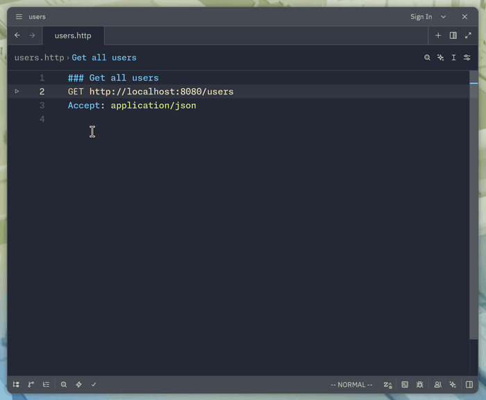
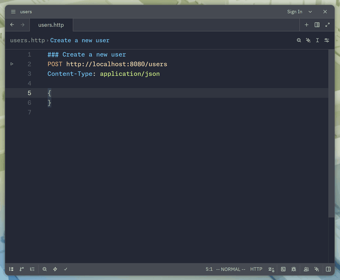
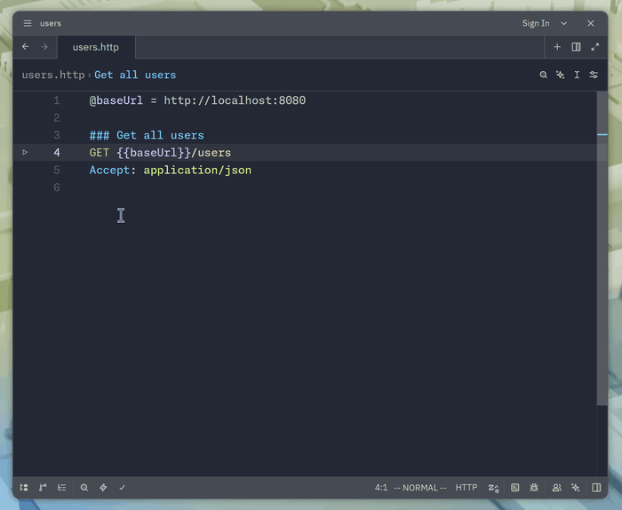
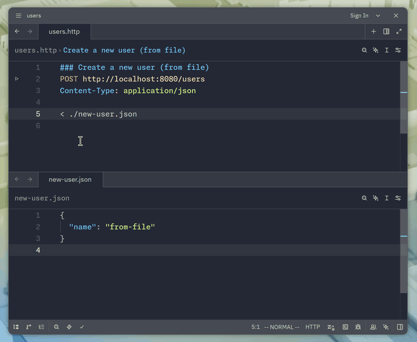
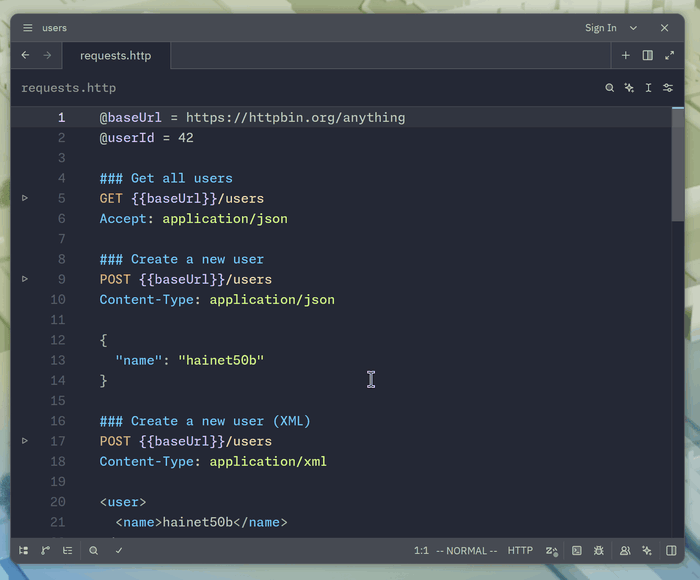
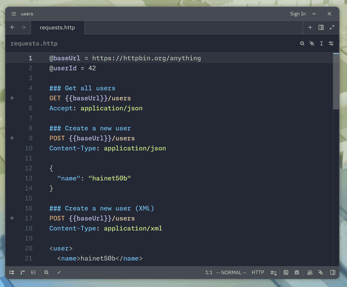

# Zed HTTP Client


A Zed extension for `.http` files, inspired by the HTTP Client in IntelliJ IDEA.

> [!NOTE]
> Initial setup is required before using these features. See [Installation](#installation).

## Features

### Run requests from the gutter

Each request gets a ▶ button. Clicking it sends the request and shows the response in the terminal panel.



### Syntax highlighting

Highlights `.http` and `.rest` files, including JSON and XML in request bodies with proper indentation.



> [!NOTE]
> XML body highlighting requires a separate XML language extension to be installed (for example, the community `XML` extension). JSON works out of the box because Zed ships with built-in JSON support.

### Variables

Define variables with `@name = value` at the top of the file and reference them with `{{name}}` in subsequent requests.



### Body file references

Send a file as the request body with `< ./payload.json`. Variables inside the referenced file are substituted.



### Response formatting

JSON and XML response bodies are pretty-printed. Each response includes the status line, content length, and elapsed time in milliseconds.

### Outline panel

All requests in the file appear in Zed's outline panel, named by their `### section title`.



### Re-run from task history

Each request becomes a Zed task labeled `{METHOD} requests | {section title}`. Past runs are available from `task:spawn`.



## Installation

To use this extension, complete the following two steps. Due to current Zed extension API limitations, the runner binary and task definition cannot be shipped with the extension itself.

### 1. Install the `httpc` binary

**Linux / macOS**:

```sh
curl -sSf https://raw.githubusercontent.com/hainet50b/zed-http-client/main/install.sh | sh
```

Installs to `~/.local/bin/httpc`. Ensure `~/.local/bin` is in your `PATH`.

**Windows (PowerShell)**:

```powershell
irm https://raw.githubusercontent.com/hainet50b/zed-http-client/main/install.ps1 | iex
```

Installs to `%USERPROFILE%\.httpc\bin\httpc.exe` and adds the directory to your user `PATH`.

Alternatively, download the prebuilt binary from [Releases](https://github.com/hainet50b/zed-http-client/releases) and place it on your `PATH` manually.

### 2. Register the runnable task

Add the following to your global `~/.config/zed/tasks.json` (or per-project `.zed/tasks.json`):

```json
[
  {
    "label": "$ZED_CUSTOM_method $ZED_STEM | $ZED_CUSTOM_title",
    "command": "httpc",
    "args": ["--file", "$ZED_FILE", "--line", "$ZED_ROW"],
    "tags": ["http-request"],
    "reveal": "no_focus",
    "use_new_terminal": false,
    "allow_concurrent_runs": false
  }
]
```

Once both are in place, click the ▶ button next to any request to execute it.

## Related Projects

- [tie304/zed-http](https://github.com/tie304/zed-http) — alternative Zed extension that bridges to the [httpYac](https://httpyac.github.io) CLI.

## Acknowledgments

This extension uses the following third-party tree-sitter grammars:

- [`rest-nvim/tree-sitter-http`](https://github.com/rest-nvim/tree-sitter-http) for parsing `.http` files — MIT License, © 2021 NTBBloodbath.
- [`tree-sitter-grammars/tree-sitter-xml`](https://github.com/tree-sitter-grammars/tree-sitter-xml) for highlighting XML request bodies — MIT License, © 2023 ObserverOfTime.

## License

Licensed under either of

 * Apache License, Version 2.0
   ([LICENSE-APACHE](LICENSE-APACHE) or <http://www.apache.org/licenses/LICENSE-2.0>)
 * MIT license
   ([LICENSE-MIT](LICENSE-MIT) or <http://opensource.org/licenses/MIT>)

at your option.

## Contribution

Unless you explicitly state otherwise, any contribution intentionally submitted
for inclusion in the work by you, as defined in the Apache-2.0 license, shall be
dual licensed as above, without any additional terms or conditions.
